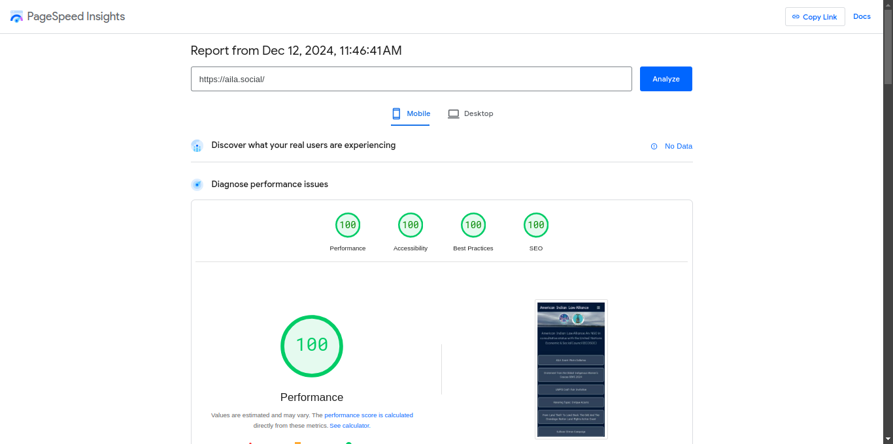
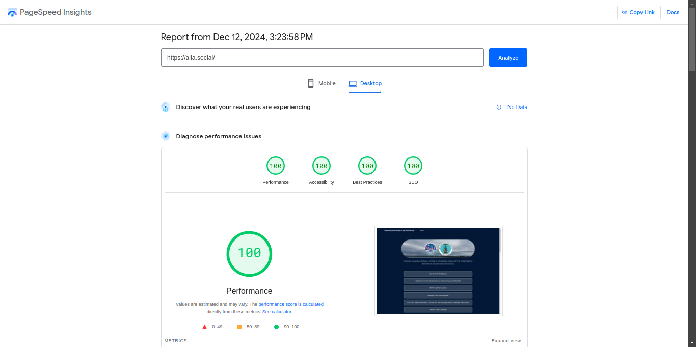

# Adam Lists Links

Developer : [Adam DJ Brett](https://adamdjbrett.com)

For Link Lists

WSRV Image CDN Version

Mobile Test

Desktop Test

### First Setup

Open `_data/metadata.js`

the metadata files is for socialcard, meta tags, and SEO. open `_data/metadata.js` and insert title description and others for SEO.

### Configuration Navbar and Footer

To setup your navbar menu and icon on footer , you can open `_data/config.yaml`

Use fontawesome icon - https://fontawesome.com/search

copy paste icon in to icon menu.

example: `fa-solid fa-envelope`

### Link Lists

To update link list , open `content/index.md`

### Wsrv image

This project is use cdn image for optimazation, if you want 11ty image you can visit our other project - [aila projects](https://github.com/adamdjbrett/aila-social)

